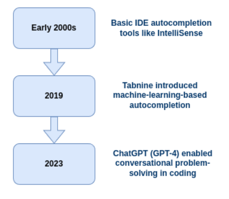
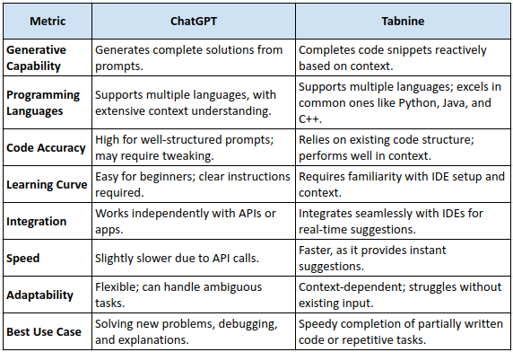
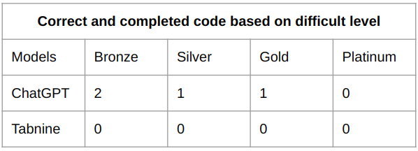
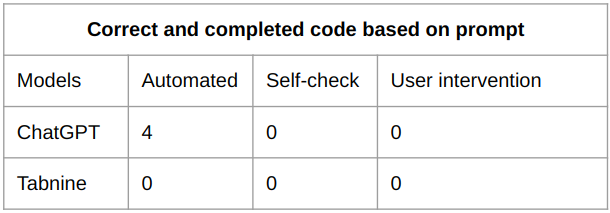
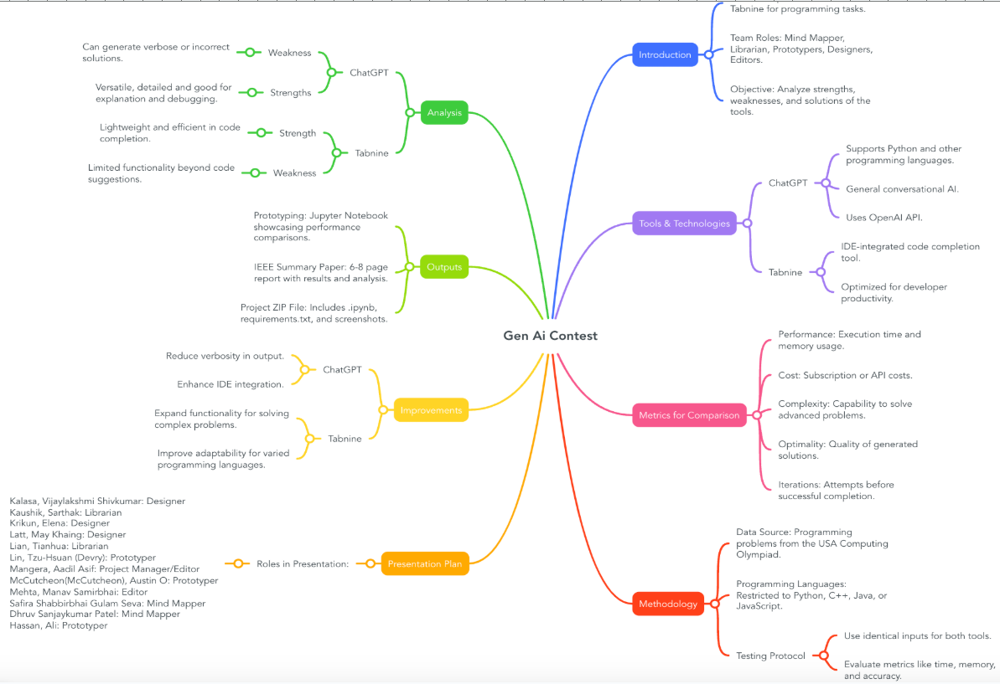

# AI-Contest---ChatGPT-vs-Tabnine

## Team Members - Group 4 

* Ahmad, Muhammad Ali Hassan, 1294002
* Patel, Dhruv Sanjaykumar, 1151147 
* Kalasa, Vijaylakshmi Shivkumar, 1267248 
* Kaushik, Sarthak, 1270126 
* Krikun, Elena, 1276575 
* Latt, May Khaing, 1276661  
* Lian, Tianhua, 1255561 
* Lin, Tzu-Hsuan, 1273233 
* Mangera, Aadil Asif, 1274539 
* McCutcheon, Austin O, 1140306 
* Mehta, Manav Samirbhai, 1275569
* Safira Shabbirbhai Gulam Seva, 1275784 

## Project Overview

This project presents a comparative analysis of two advanced AI tools, **ChatGPT** and **Tabnine**, in the context of solving 
competitive programming challenges. The primary objective was to evaluate their performance in terms of problem-solving 
capabilities, efficiency, and usability, using programming problems from the United States of America Computing Olympiad (USACO).

## Background 

## Comparison Metrics

## Methodology

1. **Tools and Setup**

* **Datasets**: Programming challenges from USACO.
* **Languages Used**: Python (primary language).
* **Development Environment:**
  * For ChatGPT: Jupyter Notebook for testing generated code.
  * For Tabnine: IDE integration with tools like Visual Studio Code.

2. **Testing Procedure**

* ChatGPT:

    * Provided natural language descriptions of USACO problems.
    * Code generated was reviewed for correctness, logic, and clarity.
    * Tested for usability in generating solutions from scratch.`

* Tabnine:

  * Integrated into the IDE for real-time code suggestions.
  * Tested its ability to autocomplete, edit, and debug code.

3. **Evaluation Metrics**

* **Code Correctness**: Accuracy of solutions against problem constraints.
* **Efficiency**: Time taken to generate and execute solutions.
* **Usability**: Ease of use for beginners and experienced developers.

## Performance Evaluation: ChatGPT vs. Tabnine

Performance by Difficulty Level

Performance Based on Prompt Type

## Mind Map

